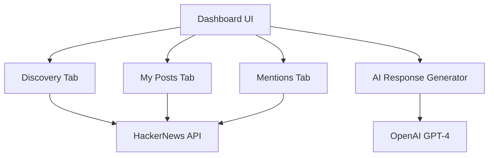

Build a comprehensive social monitoring dashboard that tracks mentions, replies, and opportunities across HackerNews and Reddit, with AI-generated responses.


## Overview

Social Monitor demonstrates:
- **Multi-tab Dashboard** - Three modes: Discovery, My Posts, Mentions
- **HackerNews Integration** - Real-time post and comment tracking
- **AI Response Generation** - OpenAI-powered reply drafting
- **Widget State Management** - Persistent tab navigation
- **Auto-refresh** - Real-time mention updates

## Architecture



## Implementation

<Steps>
  <Step title="Create unified dashboard service">
    Register a single tool that opens the multi-tab dashboard:

    ```typescript mcp/dashboard/index.ts
    import { Tool, SchemaConstraint, Optional } from '@leanmcp/core';
    import { GPTApp } from '@leanmcp/ui/server';

    class DashboardInput {
      @Optional()
      @SchemaConstraint({
        description: 'Initial tab to display',
        enum: ['discovery', 'my-posts', 'mentions'],
        default: 'discovery'
      })
      initialTab?: 'discovery' | 'my-posts' | 'mentions';
    }

    export class DashboardService {
      @Tool({
        description: 'Open Social Monitor Dashboard with three tabs: MCP Discovery, My Posts, and Mentions',
        inputClass: DashboardInput
      })
      @GPTApp({
        component: './SocialMonitorDashboard',
        title: 'Social Monitor'
      })
      async openDashboard(input: DashboardInput) {
        return {
          status: 'ready',
          initialTab: input.initialTab ?? 'discovery',
          config: {
            hnUsername: process.env.HN_USERNAME,
            openaiConfigured: !!process.env.OPENAI_API_KEY
          }
        };
      }
    }
    ```
  </Step>

  <Step title="Build HackerNews discovery service">
    Find MCP-related discussions for organic outreach:

    ```typescript mcp/discovery/index.ts
    import { Tool } from '@leanmcp/core';

    export class DiscoveryService {
      @Tool({
        description: 'Find HackerNews discussions about MCP for outreach opportunities'
      })
      async discoverMCPOpportunities() {
        const keywords = ['MCP', 'Model Context Protocol', 'Claude', 'AI agents'];
        const mentions: Mention[] = [];

        for (const keyword of keywords) {
          const response = await fetch(
            `https://hn.algolia.com/api/v1/search?query=${encodeURIComponent(keyword)}&tags=story&hitsPerPage=10`
          );
          const data = await response.json();

          for (const hit of data.hits) {
            mentions.push({
              id: `hn-${hit.objectID}`,
              platform: 'hackernews',
              mode: 'discovery',
              type: 'post',
              content: hit.title,
              url: `https://news.ycombinator.com/item?id=${hit.objectID}`,
              authorName: hit.author,
              createdAt: hit.created_at,
              status: 'pending',
              platformId: hit.objectID
            });
          }
        }

        return {
          success: true,
          mentions: mentions.slice(0, 20),
          total: mentions.length
        };
      }
    }
    ```
  </Step>

  <Step title="Track replies to your posts">
    Monitor engagement on your own content:

    ```typescript mcp/my-posts/index.ts
    import { Tool } from '@leanmcp/core';

    export class MyPostsService {
      @Tool({
        description: 'Get replies and comments on your HackerNews posts'
      })
      async getMyPostReplies() {
        const username = process.env.HN_USERNAME;
        if (!username) {
          return {
            success: false,
            error: 'HN_USERNAME not configured',
            mentions: []
          };
        }

        // Fetch user's submissions
        const userResponse = await fetch(
          `https://hacker-news.firebaseio.com/v0/user/${username}.json`
        );
        const userData = await userResponse.json();

        const mentions: Mention[] = [];

        // Get recent submissions
        const submissions = userData.submitted?.slice(0, 10) || [];

        for (const itemId of submissions) {
          const itemResponse = await fetch(
            `https://hacker-news.firebaseio.com/v0/item/${itemId}.json`
          );
          const item = await itemResponse.json();

          if (item.type === 'story' && item.kids) {
            // Fetch top-level comments
            for (const kidId of item.kids.slice(0, 5)) {
              const commentResponse = await fetch(
                `https://hacker-news.firebaseio.com/v0/item/${kidId}.json`
              );
              const comment = await commentResponse.json();

              if (comment.text) {
                mentions.push({
                  id: `hn-reply-${comment.id}`,
                  platform: 'hackernews',
                  mode: 'my-posts',
                  type: 'comment',
                  content: comment.text,
                  url: `https://news.ycombinator.com/item?id=${comment.id}`,
                  authorName: comment.by,
                  parentTitle: item.title,
                  parentUrl: `https://news.ycombinator.com/item?id=${item.id}`,
                  createdAt: new Date(comment.time * 1000).toISOString(),
                  status: 'pending',
                  platformId: comment.id.toString()
                });
              }
            }
          }
        }

        return {
          success: true,
          mentions,
          total: mentions.length
        };
      }
    }
    ```
  </Step>

  <Step title="Find product mentions">
    Track direct mentions of your product:

    ```typescript mcp/mentions/index.ts
    import { Tool } from '@leanmcp/core';

    export class MentionsService {
      @Tool({
        description: 'Find mentions of LeanMCP across HackerNews'
      })
      async getLeanMCPMentions() {
        const mentions: Mention[] = [];
        const keywords = ['leanmcp', 'lean-mcp'];

        for (const keyword of keywords) {
          const response = await fetch(
            `https://hn.algolia.com/api/v1/search?query=${keyword}&hitsPerPage=20`
          );
          const data = await response.json();

          for (const hit of data.hits) {
            const content = hit.comment_text || hit.story_text || hit.title;
            if (!content) continue;

            mentions.push({
              id: `hn-mention-${hit.objectID}`,
              platform: 'hackernews',
              mode: 'mentions',
              type: hit.comment_text ? 'comment' : 'post',
              content,
              url: `https://news.ycombinator.com/item?id=${hit.objectID}`,
              authorName: hit.author,
              parentTitle: hit.story_title,
              createdAt: hit.created_at,
              status: 'pending',
              platformId: hit.objectID
            });
          }
        }

        return {
          success: true,
          mentions: mentions.slice(0, 20),
          total: mentions.length
        };
      }
    }
    ```
  </Step>

  <Step title="Generate AI responses">
    Use OpenAI to draft contextual replies:

    ```typescript mcp/ai-response/index.ts
    import { Tool, SchemaConstraint } from '@leanmcp/core';
    import OpenAI from 'openai';

    class GenerateResponseInput {
      @SchemaConstraint({ description: 'Original mention text' })
      mentionText!: string;

      @SchemaConstraint({
        description: 'Response mode',
        enum: ['discovery', 'my-posts', 'mentions']
      })
      mode!: 'discovery' | 'my-posts' | 'mentions';

      @SchemaConstraint({
        description: 'Platform',
        enum: ['hackernews', 'reddit']
      })
      platform!: string;

      @SchemaConstraint({
        description: 'Tone',
        enum: ['professional', 'friendly', 'witty'],
        default: 'friendly'
      })
      tone?: string;
    }

    export class AIResponseService {
      private openai: OpenAI;

      constructor() {
        this.openai = new OpenAI({ apiKey: process.env.OPENAI_API_KEY });
      }

      @Tool({
        description: 'Generate AI-powered response to social mentions',
        inputClass: GenerateResponseInput
      })
      async generateResponse(input: GenerateResponseInput) {
        const modeInstructions = {
          discovery: 'This is an organic discussion about MCP. Provide helpful, non-promotional insight.',
          'my-posts': 'Reply to a comment on your post. Be appreciative and engaging.',
          mentions: 'Someone mentioned LeanMCP. Be helpful and answer their implicit question.'
        };

        const toneGuide = {
          professional: 'Be formal and technical',
          friendly: 'Be warm and conversational',
          witty: 'Be clever and engaging'
        };

        const prompt = `Generate a ${input.tone || 'friendly'} response for ${input.platform}.

        MODE: ${modeInstructions[input.mode]}
        TONE: ${toneGuide[input.tone || 'friendly']}

        ORIGINAL POST:
        ${input.mentionText}

        Guidelines:
        - Keep it concise (2-3 sentences max)
        - No emojis
        - Sound natural and human
        - ${input.mode === 'discovery' ? 'DO NOT promote LeanMCP unless directly relevant' : 'Focus on being helpful'}
        - ${input.platform === 'hackernews' ? 'HN style: technical, thoughtful, no marketing' : 'Reddit style: casual but informative'}

        Return ONLY the response text, no JSON.`;

        const completion = await this.openai.chat.completions.create({
          model: 'gpt-4o-mini',
          messages: [{ role: 'user', content: prompt }],
          temperature: 0.7,
          max_tokens: 150
        });

        return {
          success: true,
          response: completion.choices[0].message.content
        };
      }
    }
    ```
  </Step>

  <Step title="Build React dashboard with tabs">
    Create the unified dashboard UI:

    ```tsx mcp/dashboard/SocialMonitorDashboard.tsx
    import React, { useState, useEffect, useCallback } from 'react';
    import { useGptApp, useGptTool, useWidgetState, useToolOutput } from '@leanmcp/ui';

    type TabMode = 'discovery' | 'my-posts' | 'mentions';

    const TABS: { mode: TabMode; label: string }[] = [
      { mode: 'discovery', label: 'MCP Discovery' },
      { mode: 'my-posts', label: 'My Posts' },
      { mode: 'mentions', label: 'LeanMCP Mentions' }
    ];

    const TAB_TOOLS: Record<TabMode, string> = {
      'discovery': 'discoverMCPOpportunities',
      'my-posts': 'getMyPostReplies',
      'mentions': 'getLeanMCPMentions'
    };

    export function SocialMonitorDashboard() {
      const { isConnected } = useGptApp();
      const toolOutput = useToolOutput<any>();

      if (!isConnected) {
        return <LoadingScreen />;
      }

      return <DashboardContent initialTab={toolOutput?.initialTab || 'discovery'} />;
    }

    function DashboardContent({ initialTab }: { initialTab: TabMode }) {
      const [widgetState, setWidgetState] = useWidgetState<{ activeTab: TabMode }>({
        activeTab: initialTab
      });
      const { activeTab } = widgetState;
      const setActiveTab = (mode: TabMode) => 
        setWidgetState(prev => ({ ...prev, activeTab: mode }));

      const [mentions, setMentions] = useState<Mention[]>([]);
      const [respondingToId, setRespondingToId] = useState<string | null>(null);

      const { call: fetchMentions, loading } = useGptTool(TAB_TOOLS[activeTab]);

      const loadMentions = useCallback(() => {
        fetchMentions({}).then(result => {
          const data = parseToolResult(result);
          if (data?.mentions) {
            setMentions(data.mentions);
          }
        });
      }, [fetchMentions]);

      useEffect(() => {
        setMentions([]);
        setRespondingToId(null);
        loadMentions();
      }, [activeTab, loadMentions]);

      return (
        <div className="min-h-screen bg-gray-50">
          {/* Header with Tabs */}
          <header className="bg-white border-b sticky top-0 z-10">
            <div className="max-w-3xl mx-auto px-4">
              <div className="h-14 flex items-center justify-between">
                <h1 className="font-semibold">Social Monitor</h1>
                <button
                  onClick={loadMentions}
                  disabled={loading}
                  className="p-2 hover:bg-gray-100 rounded transition-colors"
                >
                  <RefreshIcon loading={loading} />
                </button>
              </div>

              {/* Tabs */}
              <div className="flex gap-6">
                {TABS.map(tab => (
                  <button
                    key={tab.mode}
                    onClick={() => setActiveTab(tab.mode)}
                    className={`py-3 text-sm font-medium border-b-2 ${
                      activeTab === tab.mode
                        ? 'border-gray-900 text-gray-900'
                        : 'border-transparent text-gray-500'
                    }`}
                  >
                    {tab.label}
                  </button>
                ))}
              </div>
            </div>
          </header>

          {/* Content */}
          <main className="max-w-3xl mx-auto px-4 py-6">
            <div className="mb-6 text-xs text-gray-500">
              {mentions.length} results • HN: {mentions.filter(m => m.platform === 'hackernews').length}
            </div>

            {loading && mentions.length === 0 ? (
              <LoadingSkeleton />
            ) : mentions.length === 0 ? (
              <EmptyState onRefresh={loadMentions} />
            ) : (
              <div className="space-y-4">
                {mentions.map(mention => (
                  <MentionCard
                    key={mention.id}
                    mention={mention}
                    isResponding={respondingToId === mention.id}
                    onToggleRespond={() => 
                      setRespondingToId(respondingToId === mention.id ? null : mention.id)
                    }
                  />
                ))}
              </div>
            )}
          </main>
        </div>
      );
    }
    ```
  </Step>

  <Step title="Add inline response editor">
    ```tsx
    function ResponseEditor({ mention }: { mention: Mention }) {
      const [response, setResponse] = useState('');
      const [tone, setTone] = useState<'professional' | 'friendly' | 'witty'>('friendly');
      const [copied, setCopied] = useState(false);

      const { call: generateResponse, loading } = useGptTool('generateResponse');

      useEffect(() => {
        generateResponse({
          mentionText: mention.content,
          mode: mention.mode,
          platform: mention.platform,
          tone
        }).then(result => {
          const data = parseToolResult(result);
          if (data?.response) setResponse(data.response);
        });
      }, [mention, tone]);

      const handleCopy = async () => {
        await navigator.clipboard.writeText(response);
        setCopied(true);
        setTimeout(() => setCopied(false), 2000);

        // Open link in new tab
        window.open(mention.url, '_blank');
      };

      return (
        <div className="mt-4 pt-4 border-t space-y-3">
          <div className="flex items-center justify-between">
            <div className="flex items-center gap-2">
              <span className="text-xs font-semibold text-gray-400">AI DRAFT</span>
              {loading && <Spinner />}
            </div>

            {/* Tone Selector */}
            <div className="flex bg-gray-100 p-0.5 rounded-lg">
              {(['professional', 'friendly', 'witty'] as const).map(t => (
                <button
                  key={t}
                  onClick={() => setTone(t)}
                  disabled={loading}
                  className={`px-2 py-0.5 text-xs rounded capitalize ${
                    tone === t ? 'bg-white shadow-sm' : 'text-gray-500'
                  }`}
                >
                  {t}
                </button>
              ))}
            </div>
          </div>

          <textarea
            value={response}
            onChange={e => setResponse(e.target.value)}
            className="w-full h-32 p-3 text-sm bg-gray-50 border rounded-md"
            placeholder="Drafting response..."
          />

          <div className="flex justify-between">
            <span className="text-xs text-gray-400">{response.length} chars</span>
            <button
              onClick={handleCopy}
              disabled={!response}
              className="px-4 py-1.5 bg-gray-900 text-white rounded-md text-sm"
            >
              {copied ? 'Copied!' : 'Copy & Open'}
            </button>
          </div>
        </div>
      );
    }
    ```
  </Step>
</Steps>

## Key Features

<CardGroup cols={2}>
  <Card title="Multi-Tab Architecture" icon="table-columns">
    - Persistent tab state with `useWidgetState`
    - Dynamic tool switching per tab
    - Auto-refresh on tab change
    - Unified data structure
  </Card>
  
  <Card title="Real-Time Monitoring" icon="clock">
    - HackerNews Algolia API
    - Firebase real-time API
    - Auto-refresh intervals
    - Manual refresh controls
  </Card>
  
  <Card title="AI Response Generation" icon="robot">
    - Context-aware prompts
    - Adjustable tone (professional/friendly/witty)
    - Platform-specific style (HN vs Reddit)
    - Copy-to-clipboard integration
  </Card>
  
  <Card title="Engagement Workflow" icon="comments">
    - Inline response editor
    - One-click open & copy
    - Status tracking (pending/responded)
    - Parent context display
  </Card>
</CardGroup>

## Environment Configuration

```bash .env
# Server
PORT=3200

# HackerNews
HN_USERNAME=your_hn_username

# OpenAI
OPENAI_API_KEY=sk-...

# Optional: Reddit (for future expansion)
# REDDIT_CLIENT_ID=...
# REDDIT_CLIENT_SECRET=...
```

## Usage

<Steps>
  <Step title="Start the server">
    ```bash
    leanmcp dev
    ```
  </Step>

  <Step title="Open dashboard">
    Call the `openDashboard` tool from ChatGPT or Claude:

    ```
    Open the social monitor dashboard
    ```
  </Step>

  <Step title="Switch between tabs">
    - **MCP Discovery**: Find organic MCP discussions
    - **My Posts**: Track replies to your content
    - **LeanMCP Mentions**: Monitor product mentions
  </Step>

  <Step title="Generate and post responses">
    1. Click "Reply" on any mention
    2. AI drafts response based on context
    3. Adjust tone if needed
    4. Click "Copy & Open" to copy response and open the original post
    5. Paste and submit manually
  </Step>
</Steps>

## Advanced Patterns

### Widget State Persistence

```typescript
const [widgetState, setWidgetState] = useWidgetState<DashboardState>({
  activeTab: 'discovery',
  filters: { platform: 'all' },
  sortBy: 'recent'
});

// State persists across tool calls
setWidgetState(prev => ({ ...prev, activeTab: 'mentions' }));
```

### Conditional AI Prompts

```typescript
const modeInstructions = {
  discovery: 'Provide helpful insight without promoting products',
  'my-posts': 'Be appreciative and engaging',
  mentions: 'Answer their question helpfully'
};

const prompt = `${modeInstructions[mode]}\n\n${mentionText}`;
```

### Copy-to-Clipboard with Navigation

```typescript
const handleCopy = async () => {
  await navigator.clipboard.writeText(response);
  setCopied(true);
  
  // Open in parent window (escape iframe)
  if (window.top) {
    window.top.location.href = mention.url;
  }
};
```

## Next Steps

<CardGroup cols={2}>
  <Card title="GitHub Roast" href="/examples/github-roast" icon="github">
    OAuth-powered GitHub profile analysis
  </Card>
  
  <Card title="UI Components" href="/examples/ui-components" icon="palette">
    Deep dive into @leanmcp/ui components
  </Card>
  
  <Card title="Multi-Platform APIs" href="/guides/creating-services" icon="link">
    Integrate HackerNews, Reddit, Twitter
  </Card>
  
  <Card title="AI Prompting" href="/guides/creating-services" icon="brain">
    Craft effective AI response generators
  </Card>
</CardGroup>
